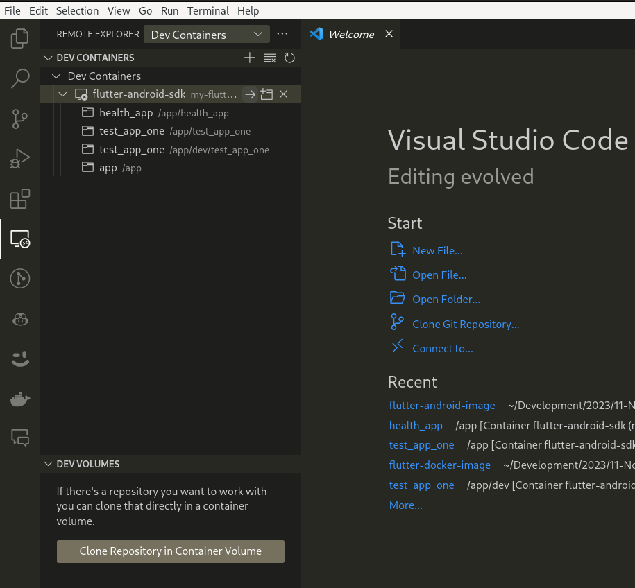
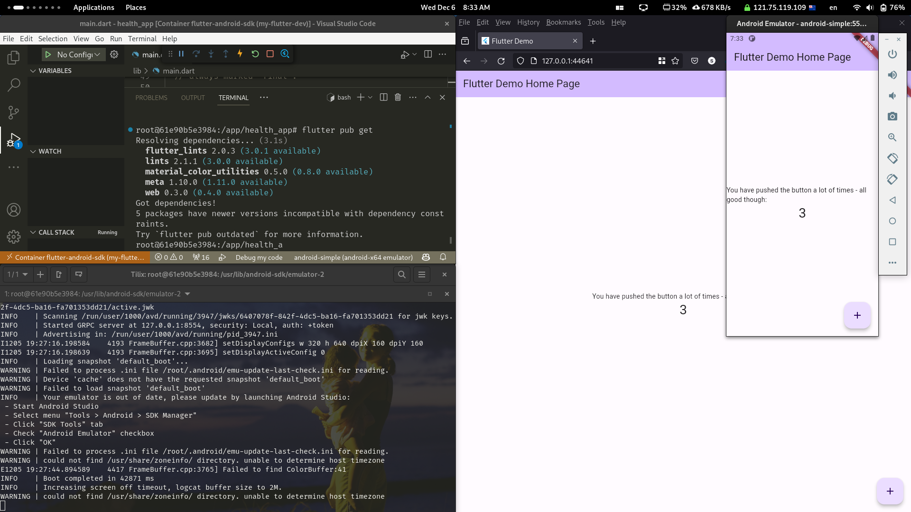
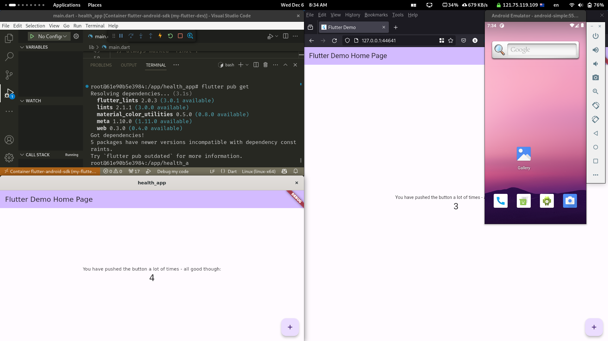

# Flutter-sdk and Android-sdk full development image

The objective of this image is to have a full development environment for flutter and android.

This image has been tested using NixOS as the host operating system.

- Options below allow this image to successfully passthrough devices and windows from the container to the host machine.
- `docker run` flags exist below to support both `X11` or `Wayland` host systems (using xwayland)

## Why this might be useful?

- This image with any container committed changes back to the image will allow you to have a full development environment with flutter-sdk and android-sdk. You will have the ability to run/debug for Android, web, Linux (all tested). This image with the below instructions followed will allow all development work to seamlessly be controlled via the host machine
- Personally, I tried to get a full working environment as noted in the above bullet directly on my NixOS host, but I had some issues, as I didn't succeed this approach was my next best option with minimal trade-offs.
- Building a good working flutter environment can be a bit of a challenge, especially if you are not familiar with the flutter and android dev ecosystem. This image will allow you to get a full working flutter environment with minimal effort.
  - Likewise, the instructions below provide a `quick-start` to get things working.

## Trade-offs

- The `Dockerfile` will produce a large image
- There will be some performance hit for the emulator. For myself, performance seems fine with no noticeable lag, but I am not sure if it will be fine for others.
  - If you want better performance, you could always make changes to run the emulator on the host directly, personally I wanted an all-in-one dev environment container
- To talk trade-offs, we need to consider what we are comparing to. If comparing to a working `flake.nix` built environment, this `Dockerfile` will likely be more brittle and not as reproducible.
  - Eventually, I expect to be instantiating my dev environment from a `flake.nix` setup.

## Untested

- I have not tried to physically attach an android device over `adb` to the container. When I do this, if there are any changes to be made to the instructions of `Dockerfile`, I will update this repo.

## Experience

VS Code with `flutter` and `dart` extensions along with  `Remote - Tunnels`, `Remote - Development`, `Remote - Explorer`, `Remote - SSH` plugins (or some combination of these `remote` plugins) will allow you to connect to the container and use the IDE in the host.

The `docker run` command will ensure you have a host folder mounted to `/app` in the container. This is where your flutter project will be located. This ensures your projects to persist if you do a `docker stop` and `docker start`

The dev experience is clean and works as well as I had it on an Ubuntu instance directly

Removing a Container: If you remove a container using `docker rm`, all the changes you made inside that container are lost. If you start a new container from the same image using `docker run`, it will be a fresh instance based on the image, without any of the changes you made in the previous container.

Committing Changes: If you want to preserve the state of a container (with all your changes) in a new Docker image, you can use the `docker commit` command. This creates a new image based on the current state of the container, which you can use to start new containers later with all those changes.

## Instructions

### Build the image

```bash
## rebuild
docker build -t flutter-android-sdk .
## rebuild without using the local cache (downloads everything again)
docker build --no-cache -t flutter-android-sdk .

```

### Run the container

#### Initial setup and after reboot

Run one of the below variants on the host to allow X11 windows from docker to be shared to the host

You will have to run this command again after rebooting your machine.

```bash
# anything can share a window to the host machine
xhost +local:

# Only docker will be able to share X11 windows to the host
xhost +local:docker

```


#### Using Wayland


```bash
# This is specifically for hosts using wayland (utilising xwayland)
docker run -it \
    -v /home/stuart/Development/2023/11-Nov/flutter/flutter-docker-image/dev:/app \
    -v /run/user/1000/bus:/run/user/1000/bus \
    -v /run/user/1000/wayland-0:/run/user/1000/wayland-0 \
    -v /run/user/1000/.Xauthority:/run/user/1000/.Xauthority \
    -e DISPLAY=$DISPLAY \
    -e XDG_RUNTIME_DIR=/run/user/1000 \
    -e WAYLAND_DISPLAY=$WAYLAND_DISPLAY \
    --device /dev/kvm \
    --name my-flutter-dev flutter-android-sdk \
    /bin/bash
```

Here is the relevant NixOS configuration of my own configuration.nix file:

_If you are on a different Linux OS, you will not need this, but may need to install `xwayland`, and the equivalent of `xorg.xhost` which is a utility for controlling access to the X server. It will likely be a package called `xhost`, please check your Linux distribution documentation._

```nix
#gnome-wayland.nix config
{ pkgs, nixpkgs-gnome
, ...
}: 

{
  services.xserver = {
    enable = true;
    displayManager.gdm = {
      enable = true;  
      wayland = true; 
    };
    desktopManager.gnome.enable = true; 
  };

  programs.xwayland.enable = true;

  services.xrdp = {
    enable = true;
    defaultWindowManager = "/run/current-system/sw/bin/gnome-session";
  };

  services.gnome.gnome-browser-connector.enable = true;

  environment.systemPackages = with pkgs; [

    xorg.xhost # installed to use flutter via docker

  ];
}
```

#### Using X11

_If you are on an X11 Linux machine, you can get everything running and passing through with this docker run set of flags_

```bash
# run the image
docker run -it \                                      
    -v /home/stuart/Development/2023/11-Nov/flutter/flutter-docker-image/dev:/app \
    -v /tmp/.X11-unix:/tmp/.X11-unix \
    -v /run/user/1000/bus:/run/user/1000/bus \
    --device /dev/kvm \
    -e DISPLAY=$DISPLAY \
    -e XDG_RUNTIME_DIR=/run/user/1000 \
    -e DBUS_SESSION_BUS_ADDRESS=unix:path=/run/user/1000/bus \
    --name my-flutter-dev \
    flutter-android-sdk \
    /bin/bash`

```

### Working in the container

Here are a few commands I have used in the container

#### Create and instantiate an android virtual device

Once you run this, the virtual device will be visible on your host desktop

```bash
# swap out 'android-simple' name for another to your preference
root@339e37f08da2:/app# avdmanager create avd -n android-simple -k "system-images;android-30;default;x86_64"

# use your decided name
root@339e37f08da2:/app# emulator -avd android-simple
```

### In VS Code

- Install your extensions for remote connecting and flutter
- Connect to your container
- Connect to your choice of 

### End results







### Warnings

- Android virtual machines can be a little bit brittle, sometimes I would have to run commands twice to have them work
- Sometimes the emulator would not start, and I would have to run `emulator -avd android-simple` again